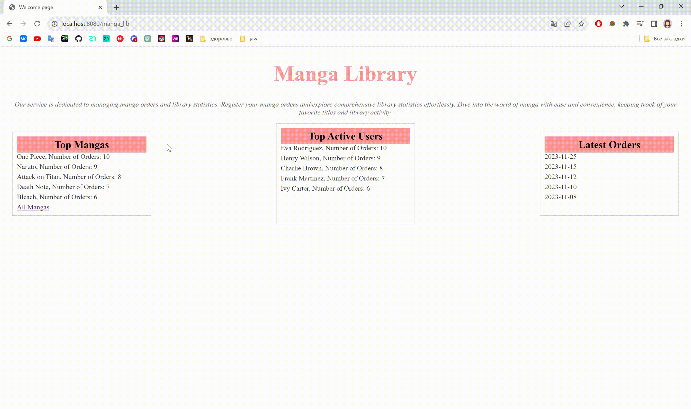

# MangaLibrary (проект находится в стадии разработки)

MangaLibrary - это веб-приложение для управления мангами (японские комиксы), пользователями и заказами. Приложение позволяет добавлять, просматривать, редактировать и удалять манги, пользователей и заказы.

## Функциональность

- **Добавление манги:** Пользователи могут добавлять новые записи о манге, указывая заголовок, автора, год и другую информацию.
- **Управление пользователями:** Позволяет добавлять новых пользователей, редактировать и удалять их профили.
- **Управление заказами:** Пользователи могут создавать заказы, добавлять мангу в заказы и отслеживать их статус.
- **Просмотр информации:** Позволяет просматривать подробную информацию о манге, пользователях и заказах.

## Технологии

Проект построен с использованием следующих технологий и инструментов:
- Java
- Spring Framework
- Thymeleaf
- HTML/CSS
- База данных (например, MySQL, PostgreSQL и т.д.)

## Установка и запуск

1. Склонируйте репозиторий на локальную машину.
2. Установите необходимые зависимости и библиотеки, используемые в проекте.
3. Настройте базу данных (если используется) и укажите соответствующие настройки в конфигурационных файлах.
4. Запустите приложение, используя среду разработки или команду запуска (например, `mvn spring-boot:run`).

## Использование

1. После запуска приложения откройте браузер и перейдите по адресу `http://localhost:PORT`, где `PORT` - порт, указанный в настройках.
2. Для добавления новых записей (манги, пользователей, заказов), перейдите на соответствующие страницы и используйте формы для создания новых записей.
3. Для просмотра, редактирования или удаления существующих записей перейдите на соответствующие страницы и следуйте инструкциям на странице.

## Демонстрация работы
(немного подождите, чтобы загрузились gif-анимации)

*Просмотр списка манги, добавление новой манги*

## Дополнительные инструкции

- Пожалуйста, убедитесь, что все зависимости и инструменты, указанные в файле `pom.xml`, установлены перед запуском приложения.
- При необходимости обновите конфигурационные файлы, такие как файлы настройки базы данных или порты, чтобы соответствовать вашему окружению.
- Для дополнительной информации о проекте обратитесь к документации или комментариям в исходном коде.

## Автор

Виктория utheryde
